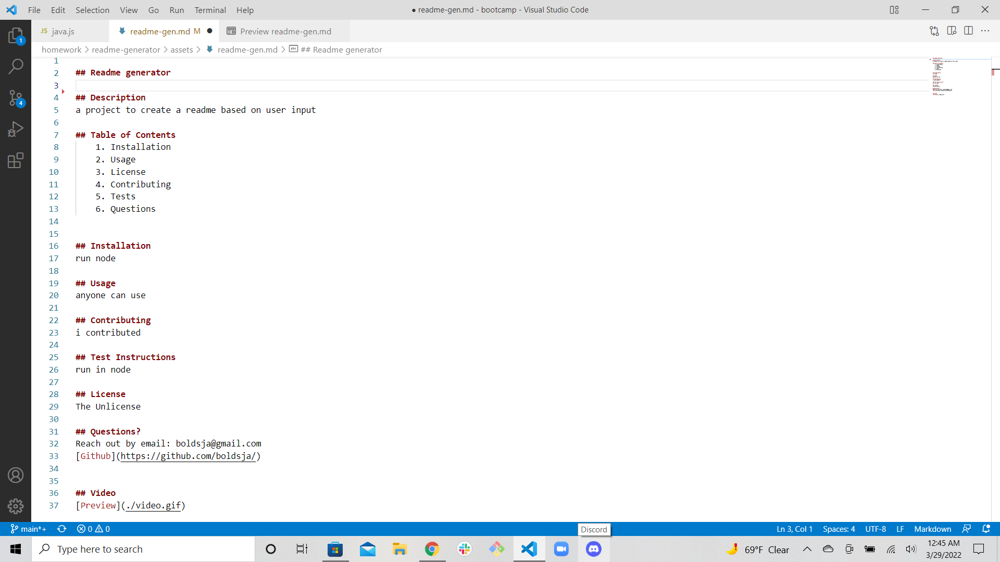

# Readme Generator

## Objective
The purpose of this project is to have a Readme file generated based on user input. There is no link to final page for this product, as it was done using node.

## Screenshot

 

## Link to Repo
[Github Repo](https://github.com/boldsja/readme-generator)
